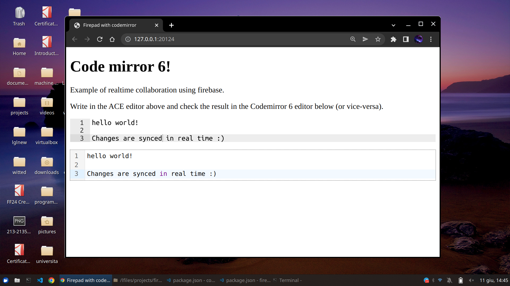

# Codemirror6 + Firepad 

Demo of Codemirror6 using the Google Firebase service to achieve real time collaboration with minimal setup.

In the `index.html` you will find two editable areas. The first one is powered by the traditional ACE Editor, while the second one is powered by Codemirror6. Editing one should result in the changes synced to the other. Enjoy!



## Getting started 

First, make sure to get a Firebase Key. It's free up to 1GB of stored data, you just have to sign in with your Google account [here](https://firebase.google.com/). If you find yourself in trouble, you may also want to check a tutorial I wrote for another project [here](https://librogamesland.github.io/magebook/#/?id=collaborative-projects).


Setup the demo:

```bash
git clone https://github.com/lucafabbian/codemirror6-firepad-demo.git
cd codemirror6-firepad-demo

# Setup firebase. Need to export before build.
# REPLACE WITH YOUR OWN KEYS - must be a valid json
export FIREBASE_CONFIG='{
  "apiKey": "AHdS3A657ufbgfnhnhH8wtXGCzPFqBWYccsdfdfXSas",
  "databaseURL": "https://my-database-default-rtdb.europe-west1.firebasedatabase.app"
}'
npm run build
npm run serve

```

Done! Now just open [http://127.0.0.1:20124/](http://127.0.0.1:20124/)